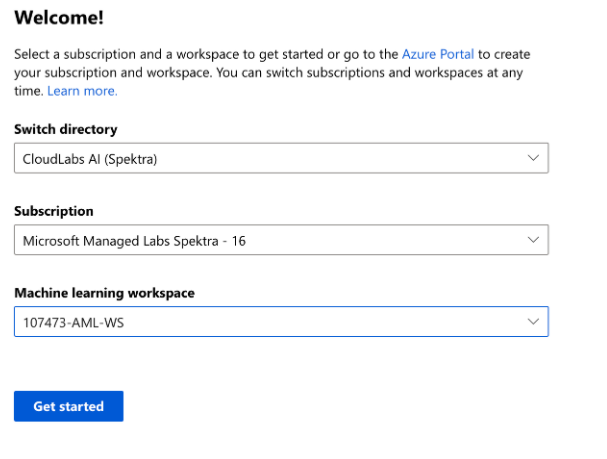

# ResponsibleAI-Airlift-July2020

<!-- 
Guidelines on README format: https://review.docs.microsoft.com/help/onboard/admin/samples/concepts/readme-template?branch=master

Guidance on onboarding samples to docs.microsoft.com/samples: https://review.docs.microsoft.com/help/onboard/admin/samples/process/onboarding?branch=master

Taxonomies for products and languages: https://review.docs.microsoft.com/new-hope/information-architecture/metadata/taxonomies?branch=master
-->

## Overview 
This repository contains content of a two-part workshop for using machine learning interpretability and fairness assessment (+ unfairness mitigation) to build fairer and more transparent models. The different components of the workshop are as follows:

- Part 1: [Interpretability with glassbox models (EBM)](https://github.com/microsoft/ResponsibleAI-Airlift/blob/main/Interpret/EBM/Interpretable%20Classification%20Methods.ipynb)
- Part 2: [Explain blackbox models with SHAP (and upload explanations to Azure Machine Learning)](https://github.com/microsoft/ResponsibleAI-Airlift/blob/main/Interpret/SHAP/explain-model-SHAP.ipynb)
- Part 3: [Run Interpretability on Azure Machine Learning](https://github.com/microsoft/ResponsibleAI-Airlift/blob/main/Interpret/SHAP/explain-model-Azure.ipynb) 
- Part 4: [Model fairness assessment and unfairness mitigation](https://github.com/microsoft/ResponsibleAI-Airlift/blob/main/Fairness/AI-fairness-Census.ipynb)

## Getting started with the workshop environment

1. Provision your personal Lab environment

    * Open the **Registration URL**: https://bit.ly/2OreKYy
    * Enter the **Activation Code** which should be provided by the instructors of the workshop.
    * Fill out the registration form and Submit it.
    * On the next screen click **Launch Lab**.
    * Wait until your personal environment is provisioned. It should take approximately 3-5 minutes.

2. Login to Azure ML studio

    * Once the workshop enviroment is ready, you can open new browser tab and navigate to Azure ML studio, using its direct URL: [https://ml.azure.com](https://ml.azure.com). We recommend using a Private Browser window for the login, to avoid conflicting credentials if you already have an Azure subscription.
    * Use the credentials provided in the workshop environment to sign-in to Azure ML studio.
    * In the Welcome screen select the preprovisioned subcription and workspace similar to screenshot below:
    
    * Click **Get started**!
    * In the welcome screen click on **Take a quick tour** button to familiarize yourself with Azure ML studio.

3. Create a VM for running the notebooks

    * Click on **Compute** tab on the left navigation bar.
    * In the "Compute Instances" section, click **New**.
    * Enter VM name of your choice and click **Create**. Creation should take approximately 5 minutes.

4. Clone this repository to Notebook VM in your Azure ML workspace

    * Once Notebook VM is created and in Running state, click on the **Jupyter** link. This will open Jupyter web UI in new browser tab.
    * In Jupyter UI click **New > Terminal**.
    * In terminal window, type and execute command: `ls`
    * Notice the name of your user folder and use that name to execute next command: `cd <userfolder>`
    * Clone the repository of this workshop by executing following command: `git clone https://github.com/microsoft/responsibleai-airlift.git`

5. Open Part 1 of the workshop

    * Go back to the Jupyter window.
    * Open [Interpretability with glassbox models (EBM)](https://github.com/microsoft/ResponsibleAI-Airlift/blob/main/Interpret/EBM/Interpretable%20Classification%20Methods.ipynb) notebook.

You are ready to start your workshop! Have fun.

## Useful Links
### Interpretability
 * [InterpretML open source](https://interpret.ml/)
 * [InterpretML AI Show (video)](https://channel9.msdn.com/Shows/AI-Show/How-to-Explain-Models-with-IntepretML-Deep-Dive)
 * [Interpretability in AzureML, concept](https://docs.microsoft.com/en-us/azure/machine-learning/how-to-machine-learning-interpretability)
 * [Interpretability in AzureML, how-to](https://docs.microsoft.com/en-us/azure/machine-learning/how-to-machine-learning-interpretability-aml)
 * [InterpretML case study](https://customers.microsoft.com/en-us/story/781802-sas-travel-transportation-azure-machine-learning)
 
 ### Fairness
 * [Fairlearn open source](https://fairlearn.github.io/)
 * [Fairlearn whitepaper](https://www.microsoft.com/en-us/research/uploads/prod/2020/05/Fairlearn_whitepaper.pdf)
 * [Fairlearn AI Show (video)](https://channel9.msdn.com/Shows/AI-Show/Building-fairer-AI-Systems-with-Fairlearn)
 * [Fairness Assessment in AzureML, concept](https://docs.microsoft.com/en-us/azure/machine-learning/concept-fairness-ml)
 * [Fairness Assessment in AzureML, how-to](https://docs.microsoft.com/en-us/azure/machine-learning/how-to-machine-learning-fairness-aml)
 * [Fairlearn case study](https://customers.microsoft.com/en-us/story/809460-ey-partner-professional-services-azure-machine-learning-fairlearn)
